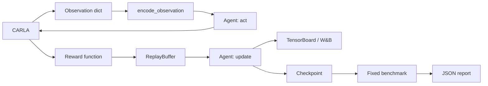

<h1 align="center">CarlaRLLab</h1>

<p align="center">
  <strong>Transparent reinforcement learning for autonomous driving in CARLA.</strong><br>
  Change the policy. Rewrite the reward. Reproduce the benchmark.
</p>

<p align="center">
  <a href="https://github.com/Wu-didi/carla-rl-lab"></a>
  <a href="https://www.python.org/"></a>
  <a href="https://carla.org/"></a>
  <a href="#algorithm-scope"></a>
</p>

<p align="center">
  <a href="https://github.com/Wu-didi/carla-rl-lab/stargazers"></a>
  <a href="https://github.com/Wu-didi/carla-rl-lab/issues"></a>
  <a href="#experiment-tracking"></a>
  <a href="#experiment-tracking"></a>
</p>

<p align="center">
  <a href="README.md">English</a> |
  <a href="README_zh-CN.md">简体中文</a> |
  <a href="docs/architecture.md">Architecture</a> |
  <a href="https://github.com/Wu-didi/carla-rl-lab/issues">Report an issue</a>
</p>

> [!IMPORTANT]
> CarlaRLLab is not an SB3 wrapper. The policy networks, update equations, rewards, training loop, logs, and benchmark protocol stay visible and editable. Version 0.1 is intentionally small: one reliable online off-policy path before more RL families are added.

## What Is Ready

| Research surface | Version 0.1 |
| --- | --- |
| Algorithms | SAC, TD3, DDPG |
| Policy networks | MLP SAC, semantic-attention SAC, deterministic actor-critic |
| CARLA control | Throttle, steering, brake |
| Rewards | Legacy reward and editable `research_v1` function |
| Tracking | TensorBoard, W&B online/offline, per-term reward logs |
| Benchmark | Reproducible `lane_following_v0` protocol and JSON report |
| Validation | CPU smoke tests for every algorithm, reward, logger, and evaluator |

## One Training Path



There is no trainer hierarchy and no chain of reward classes. Stateless research logic is implemented as plain functions; classes are reserved for objects that actually own state.

## Quick Start

The reference setup uses **CARLA 0.9.13** and **Python 3.7**.

```bash
git clone git@github.com:Wu-didi/carla-rl-lab.git
cd carla-rl-lab
conda create -n carla37 python=3.7
conda activate carla37
pip install -r requirements.txt
```

Install the matching CARLA Python API from your CARLA distribution, then start the simulator from its installation directory.

**Off-screen:**

```bash
./CarlaUE4.sh -RenderOffScreen -quality_level=Low-prefernvidia
```

**Windowed:**

```bash
./CarlaUE4.sh -quality_level=Low-prefernvidia
```

The repository wrapper preserves the same two commands:

```bash
CARLA_ROOT=/path/to/CARLA scripts/launch_carla.sh offscreen
CARLA_ROOT=/path/to/CARLA scripts/launch_carla.sh window
```

## Train

```bash
# SAC with the original reward
python scripts/train.py --algo sac --reward legacy --logger tensorboard

# TD3 with decomposed research rewards and both logging backends
python scripts/train.py --algo td3 --reward research_v1 --logger both --wandb-mode offline

# Resume DDPG from a checkpoint
python scripts/train.py --algo ddpg --checkpoint /path/to/ddpg_ckpt.pt
```

Runs are stored under `artifacts/runs/<run-name>/` and are ignored by Git.

## Edit The Research Code

The main extension points are deliberately direct:

| Goal | Edit here |
| --- | --- |
| Change SAC or its attention model | [`carla_rl_lab/algorithms/sac.py`](carla_rl_lab/algorithms/sac.py) |
| Change TD3 / DDPG | [`carla_rl_lab/algorithms/td3.py`](carla_rl_lab/algorithms/td3.py) / [`ddpg.py`](carla_rl_lab/algorithms/ddpg.py) |
| Design a reward | [`carla_rl_lab/rewards/profiles.py`](carla_rl_lab/rewards/profiles.py) |
| Change observation inputs | [`carla_rl_lab/observations/vector.py`](carla_rl_lab/observations/vector.py) |
| Change the online loop | [`scripts/train.py`](scripts/train.py) |
| Define a benchmark | [`carla_rl_lab/benchmarks/specs.py`](carla_rl_lab/benchmarks/specs.py) |

The editable reward path is a normal Python function:

```python
def research_v1_reward(obs, done, info, desired_speed):
    terms = {
        "reward/speed_tracking": ...,
        "reward/lane_centering": ...,
        "reward/collision": ...,
    }
    return sum(terms.values()), terms
```

Every term is available in TensorBoard and W&B, so reward changes can be inspected instead of inferred from a single return curve.

## Experiment Tracking

```bash
# TensorBoard is installed by default
tensorboard --logdir artifacts/runs

# W&B is optional
pip install -r requirements-wandb.txt
python scripts/train.py --algo sac --logger wandb --wandb-mode online
```

Logged signals include actor/critic losses, entropy and Q statistics, episode return, safety cost, episode length, throttle/steering/brake distributions, attention heatmaps, and reward decomposition.

## Benchmark

`lane_following_v0` fixes the environment and seeds for comparable results:

| Setting | Value |
| --- | --- |
| Town | Town05 |
| Traffic vehicles | 50 |
| Evaluation seeds | 0, 1, 2, 3, 4 |
| Episode horizon | 500 steps |
| Desired speed | 8 m/s |
| Reward | `research_v1` |

```bash
python scripts/evaluate.py \
  --algo sac \
  --checkpoint /path/to/sac_ckpt.pt \
  --benchmark lane_following_v0
```

The report contains return, cost, speed, episode length, collision rate, off-road rate, and success rate. JSON output is written to `artifacts/evaluations/`.

## Algorithm Scope

| Data source | Family | Algorithms | Status |
| --- | --- | --- | --- |
| Online | Off-policy | SAC, TD3, DDPG | Ready |
| Online | On-policy | PPO, A2C | Next runner |
| Offline | Offline RL | CQL, IQL, TD3+BC | Planned dataset runner |
| Expert / mixed | Imitation | BC, GAIL, AIRL | Planned |

On-policy and offline methods will get dedicated rollout and dataset runners. They will not be forced into the existing replay-buffer loop simply to claim a longer algorithm list.

## Project Layout

```text
carla_rl_lab/
  algorithms/       # Networks, update equations, small registry
  benchmarks/       # Fixed protocol dictionaries
  buffers/          # Replay buffer
  envs/             # CARLA environment and factory
  evaluation/       # Plain benchmark functions
  logging/          # One TensorBoard/W&B logger
  observations/     # Plain encoding functions
  rewards/          # Plain reward functions and profiles
scripts/
  train.py           # Online off-policy loop
  evaluate.py        # Deterministic benchmark entry point
  launch_carla.sh    # Remembered CARLA launch commands
tests/               # Fast CPU smoke tests
artifacts/           # Ignored runs, checkpoints, reports
```

## Roadmap

- [x] Transparent SAC, TD3, and DDPG implementations
- [x] Editable rewards with per-term logging
- [x] TensorBoard and optional W&B tracking
- [x] First fixed CARLA benchmark
- [ ] PPO with a separate rollout runner
- [ ] Offline dataset format and TD3+BC baseline
- [ ] Multi-seed benchmark tables and CI

## Smoke Test

No running CARLA server is required for the core test suite:

```bash
python -m unittest discover -s tests -v
```

## Contributing

Keep additions readable from the training entry point. Prefer a function for stateless transformations, introduce a class only when it owns meaningful state, and include a CPU smoke test for new algorithms or research interfaces.

CarlaRLLab is an independent research project built on CARLA and is not an official CARLA project.
