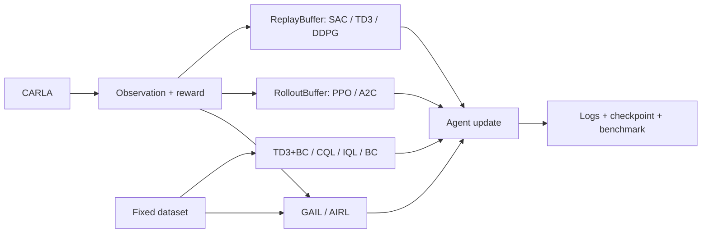

<h1 align="center">CarlaRLLab</h1>

<p align="center">
  <strong>Transparent reinforcement learning for autonomous driving in CARLA.</strong><br>
  Change the policy. Rewrite the reward. Reproduce the benchmark.
</p>

<p align="center">
  <a href="https://github.com/Wu-didi/carla-rl-lab"></a>
  <a href="https://www.python.org/"></a>
  <a href="https://carla.org/"></a>
  <a href="#algorithm-scope"></a>
</p>

<p align="center">
  <a href="https://github.com/Wu-didi/carla-rl-lab/stargazers"></a>
  <a href="https://github.com/Wu-didi/carla-rl-lab/issues"></a>
  <a href="LICENSE"></a>
  <a href="#experiment-tracking"></a>
  <a href="#experiment-tracking"></a>
</p>

<p align="center">
  <a href="README.md">English</a> |
  <a href="README_zh-CN.md">简体中文</a> |
  <a href="docs/architecture.md">Architecture</a> |
  <a href="https://github.com/Wu-didi/carla-rl-lab/issues">Report an issue</a>
</p>

> [!IMPORTANT]
> CarlaRLLab is not an SB3 wrapper. The policy networks, update equations,
> rewards, training loops, logs, and benchmark protocol stay visible and
> editable. Each data source has one small, explicit runner.

## What Is Ready

| Research surface | Version 0.1 |
| --- | --- |
| Algorithms | SAC, TD3, DDPG, PPO, A2C, TD3+BC, CQL, IQL, BC, GAIL, AIRL |
| Policy networks | Gaussian and deterministic actor-critic, semantic-attention SAC |
| CARLA versions | 0.9.13 documented; 0.9.15 code-compatible, formal validation pending |
| CARLA control | Throttle, steering, brake |
| Rewards | Legacy reward and editable `research_v1` function |
| Tracking | TensorBoard, W&B online/offline, per-term reward logs |
| Benchmark | Reproducible `lane_following_v0` protocol and JSON report |
| Validation | CPU smoke tests for every algorithm, reward, logger, and evaluator |

## Explicit Training Paths



There is no trainer hierarchy and no chain of reward classes. The four runners
only differ where their data flow differs.

## Quick Start

The reference setup uses the prebuilt **CARLA 0.9.13 Linux package** and
**Python 3.7**. The commands below assume Ubuntu x86_64, Conda, and an NVIDIA
GPU. CARLA's official guide recommends at least 6 GB of GPU memory, preferably
8 GB, about 20 GB of free disk space, and available TCP ports 2000 and 2001.
See the [CARLA 0.9.13 release](https://github.com/carla-simulator/carla/releases/tag/0.9.13)
and [official package installation guide](https://carla.readthedocs.io/en/0.9.13/start_quickstart/).

### 0. Check prerequisites

Install the basic download tools and confirm that the NVIDIA driver and Conda
are available:

```bash
sudo apt-get update
sudo apt-get install -y git wget tar

nvidia-smi
conda --version
```

If `conda` is missing, install
[Miniconda for Linux](https://docs.conda.io/projects/miniconda/en/latest/).
GPU driver installation is machine-specific and should be completed before
starting CARLA.

### 1. Choose installation directories

Keep the simulator outside this Git repository. This avoids committing CARLA's
large binaries and makes it possible to upgrade the project independently.

```bash
mkdir -p "$HOME/simulators/carla/0.9.13"
mkdir -p "$HOME/workspace"

export CARLA_ROOT="$HOME/simulators/carla/0.9.13"
export CARLA_RL_LAB_ROOT="$HOME/workspace/carla-rl-lab"
```

These variables apply to the current terminal. Add the two `export` lines to
`~/.bashrc` if you want them available in new terminals.

### 2. Download and extract CARLA 0.9.13

Download the official Ubuntu package into `CARLA_ROOT`, then extract it in the
same directory. The archive expands directly into that directory; do not create
another nested `CARLA_0.9.13/` folder inside it.

```bash
cd "$CARLA_ROOT"
wget -c https://tiny.carla.org/carla-0-9-13-linux \
  -O CARLA_0.9.13.tar.gz
tar -xzf CARLA_0.9.13.tar.gz
```

After extraction, the important files should look like this:

```text
$CARLA_ROOT/
  CarlaUE4.sh
  CarlaUE4/
  PythonAPI/
    carla/dist/
      carla-0.9.13-cp37-cp37m-manylinux_2_27_x86_64.whl
```

Verify that the launcher and Python 3.7 wheel exist:

```bash
test -x "$CARLA_ROOT/CarlaUE4.sh" && echo "CARLA server: OK"
ls "$CARLA_ROOT"/PythonAPI/carla/dist/*cp37*.whl
```

### 3. Optional: install the additional maps

This repository's `lane_following_v0` benchmark uses Town05, which is included
in the base package. Only install the additional package when you need Town06,
Town07, or Town10.

```bash
cd "$CARLA_ROOT"
wget -c https://tiny.carla.org/additional-maps-0-9-13-linux \
  -O Import/AdditionalMaps_0.9.13.tar.gz
./ImportAssets.sh
```

### 4. Clone CarlaRLLab and create the environment

```bash
git clone https://github.com/Wu-didi/carla-rl-lab.git "$CARLA_RL_LAB_ROOT"
cd "$CARLA_RL_LAB_ROOT"

conda create -n carla37 python=3.7 -y
conda activate carla37
python -m pip install -r requirements.txt
```

### 5. Install the matching CARLA Python API

Use the wheel bundled with the simulator. Installing a different `carla`
version from PyPI can cause client/server incompatibilities.

```bash
python -m pip install \
  "$CARLA_ROOT/PythonAPI/carla/dist/carla-0.9.13-cp37-cp37m-manylinux_2_27_x86_64.whl"

python -c "import carla; print('CARLA Python API:', carla.__file__)"
```

### 6. Start the CARLA server

Open **Terminal A**, enter the extracted CARLA directory, and use one of the
following project commands. The first startup can take a while.

**Off-screen:**

```bash
cd "$CARLA_ROOT"
./CarlaUE4.sh -RenderOffScreen -quality_level=Low-prefernvidia
```

**Windowed:**

```bash
cd "$CARLA_ROOT"
./CarlaUE4.sh -quality_level=Low-prefernvidia
```

The repository wrapper runs the same commands from any directory:

```bash
cd "$CARLA_RL_LAB_ROOT"
CARLA_ROOT="$CARLA_ROOT" scripts/launch_carla.sh offscreen
# Or: CARLA_ROOT="$CARLA_ROOT" scripts/launch_carla.sh window
```

### 7. Verify the server connection

Keep Terminal A running. Open **Terminal B** and connect with the same Conda
environment and default RPC port `2000`:

```bash
conda activate carla37
cd "$CARLA_RL_LAB_ROOT"

python -c "import carla; c=carla.Client('127.0.0.1', 2000); c.set_timeout(10.0); print('Connected map:', c.get_world().get_map().name)"
python -m unittest discover -s tests -v
```

If both commands succeed, the simulator, Python API, and CarlaRLLab core are
ready. Continue to the training commands below.

<details>
<summary><strong>Common setup problems</strong></summary>

- `ModuleNotFoundError: carla`: activate `carla37` and reinstall the exact
  wheel from `$CARLA_ROOT/PythonAPI/carla/dist/`.
- `*.whl is not a supported wheel`: confirm `python --version` reports Python
  3.7 on Linux x86_64, then check `python -m pip --version` is at least 20.3.
- `connection refused` or timeout: wait for CARLA to finish loading, confirm
  Terminal A is still running, and check ports `2000` and `2001` are free.
- CARLA exits during startup: run `nvidia-smi`, verify the NVIDIA driver is
  visible, and retry the off-screen low-quality command.
- Client and server version warnings: remove any separately installed `carla`
  package and reinstall the wheel bundled with CARLA 0.9.13.

</details>

## Train

```bash
# SAC with the original reward
python scripts/train.py --algo sac --reward legacy --logger tensorboard

# TD3 with decomposed research rewards and both logging backends
python scripts/train.py --algo td3 --reward research_v1 --logger both --wandb-mode offline

# Resume DDPG from a checkpoint
python scripts/train.py --algo ddpg --checkpoint /path/to/ddpg_ckpt.pt

# PPO or A2C collect fresh rollouts from CARLA
python scripts/train_on_policy.py --algo ppo --total-timesteps 1000000

# Offline RL consumes a fixed five-field .npz transition dataset
python scripts/train_offline.py --algo td3_bc --dataset /path/to/transitions.npz
python scripts/train_offline.py --algo cql --dataset /path/to/transitions.npz
python scripts/train_offline.py --algo iql --dataset /path/to/transitions.npz

# BC accepts states/actions; GAIL and AIRL also collect policy rollouts in CARLA
python scripts/train_imitation.py --algo bc --expert-dataset /path/to/expert.npz
python scripts/train_imitation.py --algo gail --expert-dataset /path/to/expert.npz
python scripts/train_imitation.py --algo airl --expert-dataset /path/to/expert.npz
```

Runs are stored under `artifacts/runs/<run-name>/` and are ignored by Git.
Offline transition datasets are `.npz` files containing `states`, `actions`,
`rewards`, `next_states`, and `dones`. BC and GAIL only require `states` and
`actions`; AIRL requires the full transition format.

## Edit The Research Code

The main extension points are deliberately direct:

| Goal | Edit here |
| --- | --- |
| Change SAC or its attention model | [`carla_rl_lab/algorithms/sac.py`](carla_rl_lab/algorithms/sac.py) |
| Change TD3 / DDPG | [`carla_rl_lab/algorithms/td3.py`](carla_rl_lab/algorithms/td3.py) / [`ddpg.py`](carla_rl_lab/algorithms/ddpg.py) |
| Change PPO / A2C | [`carla_rl_lab/algorithms/on_policy.py`](carla_rl_lab/algorithms/on_policy.py) |
| Change offline RL | [`carla_rl_lab/algorithms/offline.py`](carla_rl_lab/algorithms/offline.py) |
| Change imitation learning | [`carla_rl_lab/algorithms/imitation.py`](carla_rl_lab/algorithms/imitation.py) |
| Design a reward | [`carla_rl_lab/rewards/profiles.py`](carla_rl_lab/rewards/profiles.py) |
| Change observation inputs | [`carla_rl_lab/observations/vector.py`](carla_rl_lab/observations/vector.py) |
| Change the online loop | [`scripts/train.py`](scripts/train.py) |
| Define a benchmark | [`carla_rl_lab/benchmarks/specs.py`](carla_rl_lab/benchmarks/specs.py) |

The editable reward path is a normal Python function:

```python
def research_v1_reward(obs, done, info, desired_speed):
    terms = {
        "reward/speed_tracking": ...,
        "reward/lane_centering": ...,
        "reward/collision": ...,
    }
    return sum(terms.values()), terms
```

Every term is available in TensorBoard and W&B, so reward changes can be inspected instead of inferred from a single return curve.

## Experiment Tracking

```bash
# TensorBoard is installed by default
tensorboard --logdir artifacts/runs

# W&B is optional
pip install -r requirements-wandb.txt
python scripts/train.py --algo sac --logger wandb --wandb-mode online
```

Logged signals include actor/critic losses, entropy and Q statistics, episode return, safety cost, episode length, throttle/steering/brake distributions, attention heatmaps, and reward decomposition.

## Benchmark

`lane_following_v0` fixes the environment and seeds for comparable results:

| Setting | Value |
| --- | --- |
| Town | Town05 |
| Traffic vehicles | 50 |
| Evaluation seeds | 0, 1, 2, 3, 4 |
| Episode horizon | 500 steps |
| Desired speed | 8 m/s |
| Reward | `research_v1` |

```bash
python scripts/evaluate.py \
  --algo sac \
  --checkpoint /path/to/sac_ckpt.pt \
  --benchmark lane_following_v0
```

The report contains return, cost, speed, episode length, collision rate, off-road rate, and success rate. JSON output is written to `artifacts/evaluations/`.

## Algorithm Scope

| Data source | Family | Algorithms | Status |
| --- | --- | --- | --- |
| Online | Off-policy | SAC, TD3, DDPG | Ready |
| Online | On-policy | PPO, A2C | Ready |
| Offline | Offline RL | CQL, IQL, TD3+BC | Ready |
| Expert / mixed | Imitation | BC, GAIL, AIRL | Ready |

On-policy, offline, and imitation methods use dedicated rollout, dataset, and
mixed runners instead of being forced into the replay-buffer loop.

## Project Layout

```text
carla_rl_lab/
  algorithms/       # Networks, update equations, small registry
  benchmarks/       # Fixed protocol dictionaries
  buffers/          # Replay buffer
  envs/             # CARLA environment and factory
  evaluation/       # Plain benchmark functions
  logging/          # One TensorBoard/W&B logger
  observations/     # Plain encoding functions
  rewards/          # Plain reward functions and profiles
scripts/
  train.py           # Online off-policy loop
  train_on_policy.py # Online rollout loop
  train_offline.py   # Fixed-dataset loop
  train_imitation.py # Expert-only or expert/online mixed loop
  evaluate.py        # Deterministic benchmark entry point
  launch_carla.sh    # Remembered CARLA launch commands
tests/               # Fast CPU smoke tests
artifacts/           # Ignored runs, checkpoints, reports
```

## Roadmap / TODO

The v0.1 foundation is complete: transparent SAC/TD3/DDPG implementations,
editable reward logging, TensorBoard/W&B tracking, and the first fixed
benchmark. The next work is prioritized by reproducibility rather than by the
length of the algorithm list.

### 1. Document and validate CARLA 0.9.15

- [ ] Add a CARLA 0.9.15 installation path with the same download, extraction,
  Python API, launch, and troubleshooting detail as the 0.9.13 guide.
- [ ] Add runtime CARLA client/server version reporting to experiment metadata.
- [ ] Run connection, reset/step, one-episode, and `lane_following_v0` checks on
  both CARLA 0.9.13 and 0.9.15.
- [ ] Publish a compatibility table covering Python, Ubuntu, CARLA, maps, and
  known limitations. The current code is already compatible with 0.9.15; the
  missing work is formal documentation and repeatable validation.

### 2. Complete the main RL algorithm families

- [x] Online on-policy: implement PPO first, then A2C, with a dedicated rollout
  buffer and runner.
- [x] Offline RL: define the dataset format, then implement TD3+BC, CQL, and IQL
  with a dedicated dataset runner.
- [x] Imitation learning: add BC first, then evaluate GAIL/AIRL after the expert
  trajectory format is stable.
- [x] Require every new algorithm to provide `act/update/save/load`, the correct
  runner, a default config, a CPU smoke test, and a CARLA training command.

### 3. Train every algorithm and publish reproducible baselines

- [ ] Train every implemented algorithm in CARLA with at least 3 training seeds,
  then evaluate each checkpoint on all 5 `lane_following_v0` seeds.
- [ ] Record the Git commit, full config, seeds, environment version, reward
  profile, wall-clock time, and hardware for every run.
- [ ] Publish final and best checkpoints through GitHub Releases instead of
  committing large binary files to the Git repository.
- [ ] Commit compact JSON/CSV benchmark results, learning curves, aggregate
  mean/std tables, and failure analysis for each algorithm.

### 4. Improve and validate the state representation

- [ ] Document every observation field, vector slice, shape, unit, range, and
  update frequency.
- [ ] Add explicit normalization and clipping statistics instead of relying on
  raw heterogeneous sensor scales.
- [ ] Evaluate single-frame, frame-stacked, and recurrent state representations
  for partially observable driving situations.
- [ ] Add ablations for ego state, lane information, waypoints, LiDAR, and risk
  field inputs, including checks for information leakage and missing sensors.

### 5. Write a detailed tutorial for every algorithm

- [ ] Add `docs/algorithms/<algorithm>.md` for each implemented method.
- [ ] Cover the paper and objective, key equations, network structure, replay or
  rollout data flow, and the exact mapping from equations to source code.
- [ ] Include installation, training, resume, evaluation, checkpoint download,
  expected metrics/curves, hyperparameter guidance, and troubleshooting.
- [ ] Provide a minimal modification exercise for policy architecture and reward
  design so each tutorial is useful for research rather than only reproduction.

### 6. Provide one-command installation and Docker environments

- [ ] Add a single setup command, such as `scripts/setup.sh --carla 0.9.15`,
  that creates the Python environment, installs project dependencies and the
  matching CARLA API, and keeps every action visible in the terminal.
- [ ] Add an environment doctor that checks the OS, Python, NVIDIA driver,
  CUDA/GPU visibility, CARLA client version, server connection, required ports,
  and common version conflicts with actionable error messages.
- [ ] Provide versioned environment definitions for CARLA 0.9.13 and 0.9.15 so
  a fresh installation does not depend on unpinned transitive packages.
- [ ] Provide an NVIDIA-enabled Docker image and Docker Compose workflow for the
  CARLA server and CarlaRLLab trainer, with mounted datasets, checkpoints, and
  experiment logs.
- [ ] Verify both native and Docker installation paths on a clean machine in CI;
  the target user flow is one setup command followed by one smoke-test command.

The Docker path will complement, not replace, native installation. Researchers
must still be able to modify source files and run experiments directly without
learning a container-specific framework.

## Smoke Test

No running CARLA server is required for the core test suite:

```bash
python -m unittest discover -s tests -v
```

## Contributing

Keep additions readable from the training entry point. Prefer a function for stateless transformations, introduce a class only when it owns meaningful state, and include a CPU smoke test for new algorithms or research interfaces.

## License

CarlaRLLab is released under the [MIT License](LICENSE).

CarlaRLLab is an independent research project built on CARLA and is not an official CARLA project.
