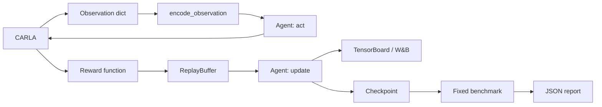

<h1 align="center">CarlaRLLab</h1>

<p align="center">
  <strong>面向 CARLA 自动驾驶研究的透明强化学习平台。</strong><br>
  修改策略网络，重写奖励函数，复现实验基准。
</p>

<p align="center">
  <a href="https://github.com/Wu-didi/carla-rl-lab"></a>
  <a href="https://www.python.org/"></a>
  <a href="https://carla.org/"></a>
  <a href="#算法规划"></a>
</p>

<p align="center">
  <a href="https://github.com/Wu-didi/carla-rl-lab/stargazers"></a>
  <a href="https://github.com/Wu-didi/carla-rl-lab/issues"></a>
  <a href="LICENSE"></a>
  <a href="#实验日志"></a>
  <a href="#实验日志"></a>
</p>

<p align="center">
  <a href="README.md">English</a> |
  <a href="README_zh-CN.md">简体中文</a> |
  <a href="docs/architecture.md">架构说明</a> |
  <a href="https://github.com/Wu-didi/carla-rl-lab/issues">提交问题</a>
</p>

> [!IMPORTANT]
> CarlaRLLab 不是 SB3 的 CARLA 封装。策略网络、更新公式、奖励函数、训练循环、日志和 benchmark 协议都保持可见、可改。v0.1 刻意控制范围：先把在线 off-policy 主链路做可靠，再扩展更多 RL 类型。

## 当前能力

| 科研模块 | v0.1 |
| --- | --- |
| 算法 | SAC、TD3、DDPG |
| 策略网络 | MLP SAC、语义注意力 SAC、确定性 Actor-Critic |
| CARLA 控制 | 油门、方向盘、刹车 |
| 奖励 | 原始 legacy reward、可直接修改的 `research_v1` 函数 |
| 日志 | TensorBoard、W&B 在线/离线、reward 分项日志 |
| Benchmark | 可复现的 `lane_following_v0` 协议与 JSON 报告 |
| 验证 | 覆盖算法、奖励、日志和评测的 CPU 冒烟测试 |

## 一条训练主链路



项目没有 trainer 继承树，也没有 reward class 链。无状态科研逻辑使用普通函数，只有真正持有状态的对象才使用 class。

## 快速开始

当前参考环境使用预编译的 **CARLA 0.9.13 Linux 安装包**与
**Python 3.7**。以下命令默认使用 Ubuntu x86_64、Conda 和 NVIDIA GPU。
CARLA 官方建议至少 6 GB 显存，推荐 8 GB，预留约 20 GB 磁盘空间，并确保
TCP 端口 2000 和 2001 可用。下载来源参见
[CARLA 0.9.13 官方 Release](https://github.com/carla-simulator/carla/releases/tag/0.9.13)
与[官方安装文档](https://carla.readthedocs.io/en/0.9.13/start_quickstart/)。

### 0. 检查基础条件

安装下载所需的基础工具，并确认 NVIDIA 驱动和 Conda 已经可用：

```bash
sudo apt-get update
sudo apt-get install -y git wget tar

nvidia-smi
conda --version
```

如果找不到 `conda`，先安装
[Linux 版 Miniconda](https://docs.conda.io/projects/miniconda/en/latest/)。GPU 驱动安装方式
与具体机器有关，需要在启动 CARLA 前完成。

### 1. 规划安装目录

CARLA 模拟器不要解压到本 Git 仓库中。将大型二进制文件和项目源码分开，后续更新
CarlaRLLab 时不会误操作模拟器文件。

```bash
mkdir -p "$HOME/simulators/carla/0.9.13"
mkdir -p "$HOME/workspace"

export CARLA_ROOT="$HOME/simulators/carla/0.9.13"
export CARLA_RL_LAB_ROOT="$HOME/workspace/carla-rl-lab"
```

变量只对当前终端有效。需要在新终端中自动生效时，将两条 `export` 命令加入
`~/.bashrc`。

### 2. 下载并解压 CARLA 0.9.13

在 `CARLA_ROOT` 中下载官方 Ubuntu 安装包，并直接解压到当前目录。压缩包会把
`CarlaUE4.sh` 等文件释放到当前目录，不要再额外创建一层嵌套的
`CARLA_0.9.13/` 文件夹。

```bash
cd "$CARLA_ROOT"
wget -c https://tiny.carla.org/carla-0-9-13-linux \
  -O CARLA_0.9.13.tar.gz
tar -xzf CARLA_0.9.13.tar.gz
```

解压后的关键目录应当如下：

```text
$CARLA_ROOT/
  CarlaUE4.sh
  CarlaUE4/
  PythonAPI/
    carla/dist/
      carla-0.9.13-cp37-cp37m-manylinux_2_27_x86_64.whl
```

确认启动脚本与 Python 3.7 wheel 均存在：

```bash
test -x "$CARLA_ROOT/CarlaUE4.sh" && echo "CARLA server: OK"
ls "$CARLA_ROOT"/PythonAPI/carla/dist/*cp37*.whl
```

### 3. 可选：安装额外地图

本项目的 `lane_following_v0` benchmark 使用基础包已经包含的 Town05，因此第一版
无需下载额外地图。只有需要 Town06、Town07 或 Town10 时才执行：

```bash
cd "$CARLA_ROOT"
wget -c https://tiny.carla.org/additional-maps-0-9-13-linux \
  -O Import/AdditionalMaps_0.9.13.tar.gz
./ImportAssets.sh
```

### 4. 下载 CarlaRLLab 并创建 Python 环境

```bash
git clone https://github.com/Wu-didi/carla-rl-lab.git "$CARLA_RL_LAB_ROOT"
cd "$CARLA_RL_LAB_ROOT"

conda create -n carla37 python=3.7 -y
conda activate carla37
python -m pip install -r requirements.txt
```

### 5. 安装完全匹配的 CARLA Python API

使用 CARLA 安装包自带的 wheel。不要随意从 PyPI 安装其他版本的 `carla`，否则
Python client 与 CARLA server 可能不兼容。

```bash
python -m pip install \
  "$CARLA_ROOT/PythonAPI/carla/dist/carla-0.9.13-cp37-cp37m-manylinux_2_27_x86_64.whl"

python -c "import carla; print('CARLA Python API:', carla.__file__)"
```

### 6. 启动 CARLA Server

打开**终端 A**，进入解压后的 CARLA 根目录，使用下面任一项目约定命令。首次启动
可能需要等待一段时间。

**无界面模式：**

```bash
cd "$CARLA_ROOT"
./CarlaUE4.sh -RenderOffScreen -quality_level=Low-prefernvidia
```

**窗口模式：**

```bash
cd "$CARLA_ROOT"
./CarlaUE4.sh -quality_level=Low-prefernvidia
```

仓库中的启动脚本可以在任意目录执行相同命令：

```bash
cd "$CARLA_RL_LAB_ROOT"
CARLA_ROOT="$CARLA_ROOT" scripts/launch_carla.sh offscreen
# 或者：CARLA_ROOT="$CARLA_ROOT" scripts/launch_carla.sh window
```

### 7. 验证 Server 连接与项目环境

保持终端 A 运行。打开**终端 B**，激活同一个 Conda 环境，并连接默认 RPC 端口
`2000`：

```bash
conda activate carla37
cd "$CARLA_RL_LAB_ROOT"

python -c "import carla; c=carla.Client('127.0.0.1', 2000); c.set_timeout(10.0); print('Connected map:', c.get_world().get_map().name)"
python -m unittest discover -s tests -v
```

两条命令都成功后，说明模拟器、Python API 和 CarlaRLLab 核心环境已经就绪，可以
继续执行下一节的训练命令。

<details>
<summary><strong>常见安装问题</strong></summary>

- `ModuleNotFoundError: carla`：确认已经激活 `carla37`，然后重新安装
  `$CARLA_ROOT/PythonAPI/carla/dist/` 中的准确版本 wheel。
- `*.whl is not a supported wheel`：确认 `python --version` 为 Linux x86_64
  平台上的 Python 3.7，并检查 `python -m pip --version` 不低于 20.3。
- `connection refused` 或连接超时：等待 CARLA 完成启动，确认终端 A 仍在运行，
  并检查端口 `2000`、`2001` 是否被占用。
- CARLA 启动后退出：运行 `nvidia-smi` 检查 NVIDIA 驱动是否可见，然后重试无界面
  低画质启动命令。
- Client 与 Server 版本不一致：卸载环境中单独安装的 `carla`，重新安装 CARLA
  0.9.13 安装包自带的 wheel。

</details>

## 训练

```bash
# SAC + 原始奖励
python scripts/train.py --algo sac --reward legacy --logger tensorboard

# TD3 + 可分解科研奖励 + 两种日志后端
python scripts/train.py --algo td3 --reward research_v1 --logger both --wandb-mode offline

# 从 checkpoint 恢复 DDPG
python scripts/train.py --algo ddpg --checkpoint /path/to/ddpg_ckpt.pt
```

实验输出位于 `artifacts/runs/<run-name>/`，默认不会提交到 Git。

## 修改科研代码

主要扩展入口保持直接：

| 目标 | 修改位置 |
| --- | --- |
| 修改 SAC 或注意力模型 | [`carla_rl_lab/algorithms/sac.py`](carla_rl_lab/algorithms/sac.py) |
| 修改 TD3 / DDPG | [`carla_rl_lab/algorithms/td3.py`](carla_rl_lab/algorithms/td3.py) / [`ddpg.py`](carla_rl_lab/algorithms/ddpg.py) |
| 设计奖励函数 | [`carla_rl_lab/rewards/profiles.py`](carla_rl_lab/rewards/profiles.py) |
| 修改观测输入 | [`carla_rl_lab/observations/vector.py`](carla_rl_lab/observations/vector.py) |
| 修改在线训练循环 | [`scripts/train.py`](scripts/train.py) |
| 定义 benchmark | [`carla_rl_lab/benchmarks/specs.py`](carla_rl_lab/benchmarks/specs.py) |

奖励路径就是一个普通 Python 函数：

```python
def research_v1_reward(obs, done, info, desired_speed):
    terms = {
        "reward/speed_tracking": ...,
        "reward/lane_centering": ...,
        "reward/collision": ...,
    }
    return sum(terms.values()), terms
```

每个奖励项都会写入 TensorBoard 和 W&B，奖励修改的影响不必只靠一条总 return 曲线猜测。

## 实验日志

```bash
# TensorBoard 已包含在默认依赖中
tensorboard --logdir artifacts/runs

# W&B 为可选依赖
pip install -r requirements-wandb.txt
python scripts/train.py --algo sac --logger wandb --wandb-mode online
```

日志包含 actor/critic loss、entropy、Q 值、episode return、safety cost、episode 长度、油门/方向/刹车分布、注意力热图和 reward 分项。

## Benchmark

`lane_following_v0` 固定环境与随机种子，保证结果具有可比性：

| 配置 | 值 |
| --- | --- |
| 地图 | Town05 |
| 交通车辆 | 50 |
| 评测种子 | 0、1、2、3、4 |
| Episode 上限 | 500 steps |
| 目标速度 | 8 m/s |
| 奖励 | `research_v1` |

```bash
python scripts/evaluate.py \
  --algo sac \
  --checkpoint /path/to/sac_ckpt.pt \
  --benchmark lane_following_v0
```

报告包含 return、cost、速度、episode 长度、碰撞率、驶出道路率和成功率，JSON 文件写入 `artifacts/evaluations/`。

## 算法规划

| 数据来源 | 类型 | 算法 | 状态 |
| --- | --- | --- | --- |
| Online | Off-policy | SAC、TD3、DDPG | 已实现 |
| Online | On-policy | PPO、A2C | 下一阶段独立 runner |
| Offline | Offline RL | CQL、IQL、TD3+BC | 规划 dataset runner |
| Expert / mixed | Imitation | BC、GAIL、AIRL | 规划中 |

On-policy 与 offline 算法会使用独立的 rollout runner 和 dataset runner，不会为了增加算法数量而强行塞入当前 replay-buffer 循环。

## 项目结构

```text
carla_rl_lab/
  algorithms/       # 网络、更新公式、小型算法注册表
  benchmarks/       # 固定协议字典
  buffers/          # Replay buffer
  envs/             # CARLA 环境与工厂函数
  evaluation/       # 普通 benchmark 函数
  logging/          # 单一 TensorBoard/W&B logger
  observations/     # 普通观测编码函数
  rewards/          # 普通奖励函数与 profile
scripts/
  train.py           # 在线 off-policy 主循环
  evaluate.py        # 确定性评测入口
  launch_carla.sh    # 已记录的 CARLA 启动命令
tests/               # 快速 CPU 冒烟测试
artifacts/           # 不提交的日志、checkpoint、报告
```

## Roadmap

- [x] 透明实现 SAC、TD3、DDPG
- [x] 奖励函数可编辑并记录每个分项
- [x] TensorBoard 与可选 W&B
- [x] 第一个固定 CARLA benchmark
- [ ] PPO 与独立 rollout runner
- [ ] Offline dataset 格式与 TD3+BC baseline
- [ ] 多随机种子结果表与 CI

## 冒烟测试

核心测试不需要启动 CARLA server：

```bash
python -m unittest discover -s tests -v
```

## 参与贡献

新增代码应当能从训练入口快速跟读。无状态变换优先使用函数；只有确实持有状态时才引入 class；新增算法或科研接口需要提供 CPU 冒烟测试。

## 开源许可

CarlaRLLab 使用 [MIT License](LICENSE) 开源。

CarlaRLLab 是基于 CARLA 构建的独立科研项目，不是 CARLA 官方项目。
