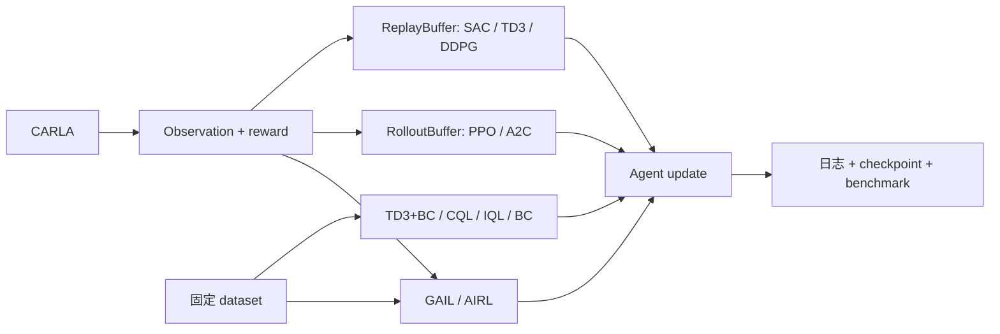

<h1 align="center">CarlaRLLab</h1>

<p align="center">
  <strong>面向 CARLA 自动驾驶研究的透明强化学习平台。</strong><br>
  修改策略网络，重写奖励函数，复现实验基准。
</p>

<p align="center">
  <a href="https://github.com/Wu-didi/carla-rl-lab"></a>
  <a href="https://www.python.org/"></a>
  <a href="https://carla.org/"></a>
  <a href="#算法规划"></a>
</p>

<p align="center">
  <a href="https://github.com/Wu-didi/carla-rl-lab/stargazers"></a>
  <a href="https://github.com/Wu-didi/carla-rl-lab/issues"></a>
  <a href="LICENSE"></a>
  <a href="#实验日志"></a>
  <a href="#实验日志"></a>
</p>

<p align="center">
  <a href="README.md">English</a> |
  <a href="README_zh-CN.md">简体中文</a> |
  <a href="docs/architecture.md">架构说明</a> |
  <a href="https://github.com/Wu-didi/carla-rl-lab/issues">提交问题</a>
</p>

> [!IMPORTANT]
> CarlaRLLab 不是 SB3 的 CARLA 封装。策略网络、更新公式、奖励函数、训练循环、
> 日志和 benchmark 协议都保持可见、可改。每种数据源只对应一个小而明确的 runner。

## 当前能力

| 科研模块 | v0.1 |
| --- | --- |
| 算法 | SAC、TD3、DDPG、PPO、A2C、TD3+BC、CQL、IQL、BC、GAIL、AIRL |
| 策略网络 | Gaussian 与确定性 Actor-Critic、语义注意力 SAC |
| CARLA 版本 | 0.9.13 已有文档；0.9.15 connection/reset/step 已验证，完整 benchmark 待完成 |
| CARLA 控制 | 明确的 `signed_3d` 与 `longitudinal_2d` policy action space |
| 奖励 | 原始 legacy reward、可直接修改的 `research_v1` 函数 |
| 日志 | TensorBoard、W&B 在线/离线、reward 分项日志 |
| Benchmark | 论文标准评测启动器与轻量内部 suite |
| 验证 | CPU 更新与回归测试；真实 CARLA 收敛验证仍待完成 |

## 明确分离的训练链路



项目没有 trainer 继承树，也没有 reward class 链。四个 runner 只在数据流确实不同时
分开。

## 快速开始

当前参考环境使用预编译的 **CARLA 0.9.13 Linux 安装包**与
**Python 3.7**。以下命令默认使用 Ubuntu x86_64、Conda 和 NVIDIA GPU。
CARLA 官方建议至少 6 GB 显存，推荐 8 GB，预留约 20 GB 磁盘空间，并确保
TCP 端口 2000 和 2001 可用。下载来源参见
[CARLA 0.9.13 官方 Release](https://github.com/carla-simulator/carla/releases/tag/0.9.13)
与[官方安装文档](https://carla.readthedocs.io/en/0.9.13/start_quickstart/)。

### 0. 检查基础条件

安装下载所需的基础工具，并确认 NVIDIA 驱动和 Conda 已经可用：

```bash
sudo apt-get update
sudo apt-get install -y git wget tar

nvidia-smi
conda --version
```

如果找不到 `conda`，先安装
[Linux 版 Miniconda](https://docs.conda.io/projects/miniconda/en/latest/)。GPU 驱动安装方式
与具体机器有关，需要在启动 CARLA 前完成。

### 1. 规划安装目录

CARLA 模拟器不要解压到本 Git 仓库中。将大型二进制文件和项目源码分开，后续更新
CarlaRLLab 时不会误操作模拟器文件。

```bash
mkdir -p "$HOME/simulators/carla/0.9.13"
mkdir -p "$HOME/workspace"

export CARLA_ROOT="$HOME/simulators/carla/0.9.13"
export CARLA_RL_LAB_ROOT="$HOME/workspace/carla-rl-lab"
```

变量只对当前终端有效。需要在新终端中自动生效时，将两条 `export` 命令加入
`~/.bashrc`。

### 2. 下载并解压 CARLA 0.9.13

在 `CARLA_ROOT` 中下载官方 Ubuntu 安装包，并直接解压到当前目录。压缩包会把
`CarlaUE4.sh` 等文件释放到当前目录，不要再额外创建一层嵌套的
`CARLA_0.9.13/` 文件夹。

```bash
cd "$CARLA_ROOT"
wget -c https://tiny.carla.org/carla-0-9-13-linux \
  -O CARLA_0.9.13.tar.gz
tar -xzf CARLA_0.9.13.tar.gz
```

解压后的关键目录应当如下：

```text
$CARLA_ROOT/
  CarlaUE4.sh
  CarlaUE4/
  PythonAPI/
    carla/dist/
      carla-0.9.13-cp37-cp37m-manylinux_2_27_x86_64.whl
```

确认启动脚本与 Python 3.7 wheel 均存在：

```bash
test -x "$CARLA_ROOT/CarlaUE4.sh" && echo "CARLA server: OK"
ls "$CARLA_ROOT"/PythonAPI/carla/dist/*cp37*.whl
```

### 3. 可选：安装额外地图

本项目的 `lane_following_v0` benchmark 使用基础包已经包含的 Town05，因此第一版
无需下载额外地图。只有需要 Town06、Town07 或 Town10 时才执行：

```bash
cd "$CARLA_ROOT"
wget -c https://tiny.carla.org/additional-maps-0-9-13-linux \
  -O Import/AdditionalMaps_0.9.13.tar.gz
./ImportAssets.sh
```

### 4. 下载 CarlaRLLab 并创建 Python 环境

```bash
git clone https://github.com/Wu-didi/carla-rl-lab.git "$CARLA_RL_LAB_ROOT"
cd "$CARLA_RL_LAB_ROOT"

conda create -n carla37 python=3.7 -y
conda activate carla37
python -m pip install -r requirements.txt
```

### 5. 安装完全匹配的 CARLA Python API

使用 CARLA 安装包自带的 wheel。不要随意从 PyPI 安装其他版本的 `carla`，否则
Python client 与 CARLA server 可能不兼容。

```bash
python -m pip install \
  "$CARLA_ROOT/PythonAPI/carla/dist/carla-0.9.13-cp37-cp37m-manylinux_2_27_x86_64.whl"

python -c "import carla; print('CARLA Python API:', carla.__file__)"
```

### 6. 启动 CARLA Server

打开**终端 A**，进入解压后的 CARLA 根目录，使用下面任一项目约定命令。首次启动
可能需要等待一段时间。

**无界面模式：**

```bash
cd "$CARLA_ROOT"
./CarlaUE4.sh -RenderOffScreen -quality_level=Low-prefernvidia
```

**窗口模式：**

```bash
cd "$CARLA_ROOT"
./CarlaUE4.sh -quality_level=Low-prefernvidia
```

仓库中的启动脚本可以在任意目录执行相同命令：

```bash
cd "$CARLA_RL_LAB_ROOT"
CARLA_ROOT="$CARLA_ROOT" scripts/launch_carla.sh offscreen
# 或者：CARLA_ROOT="$CARLA_ROOT" scripts/launch_carla.sh window
```

### 7. 验证 Server 连接与项目环境

保持终端 A 运行。打开**终端 B**，激活同一个 Conda 环境，并连接默认 RPC 端口
`2000`：

```bash
conda activate carla37
cd "$CARLA_RL_LAB_ROOT"

python -c "import carla; c=carla.Client('127.0.0.1', 2000); c.set_timeout(10.0); print('Connected map:', c.get_world().get_map().name)"
python -m unittest discover -s tests -v
```

两条命令都成功后，说明模拟器、Python API 和 CarlaRLLab 核心环境已经就绪，可以
继续执行下一节的训练命令。

<details>
<summary><strong>常见安装问题</strong></summary>

- `ModuleNotFoundError: carla`：确认已经激活 `carla37`，然后重新安装
  `$CARLA_ROOT/PythonAPI/carla/dist/` 中的准确版本 wheel。
- `*.whl is not a supported wheel`：确认 `python --version` 为 Linux x86_64
  平台上的 Python 3.7，并检查 `python -m pip --version` 不低于 20.3。
- `connection refused` 或连接超时：等待 CARLA 完成启动，确认终端 A 仍在运行，
  并检查端口 `2000`、`2001` 是否被占用。
- CARLA 启动后退出：运行 `nvidia-smi` 检查 NVIDIA 驱动是否可见，然后重试无界面
  低画质启动命令。
- Client 与 Server 版本不一致：卸载环境中单独安装的 `carla`，重新安装 CARLA
  0.9.13 安装包自带的 wheel。

</details>

## 训练

```bash
# SAC + 原始奖励
python scripts/train.py --algo sac --reward legacy --logger tensorboard

# TD3 + 可分解科研奖励 + 两种日志后端
python scripts/train.py --algo td3 --reward research_v1 --logger both --wandb-mode offline

# 从 checkpoint 恢复 DDPG
python scripts/train.py --algo ddpg --checkpoint /path/to/ddpg_ckpt.pt

# PPO / A2C 从 CARLA 收集 fresh rollout
python scripts/train_on_policy.py --algo ppo --total-timesteps 1000000

# 使用 CARLA Traffic Manager 采集专家数据
python scripts/collect_dataset.py \
  --policy autopilot \
  --transitions 100000 \
  --output artifacts/datasets/town05_autopilot.npz

# 对运行中的 server 执行真实 connection/reset/step 冒烟
python scripts/smoke_carla.py --port 2000 --town Town05 --steps 3

# Offline RL 使用带版本和元数据的 .npz transition dataset
python scripts/train_offline.py --algo td3_bc --dataset /path/to/transitions.npz
python scripts/train_offline.py --algo cql --dataset /path/to/transitions.npz
python scripts/train_offline.py --algo iql --dataset /path/to/transitions.npz

# BC 只需 states/actions；GAIL、AIRL 还会在 CARLA 中收集 policy rollout
python scripts/train_imitation.py --algo bc --expert-dataset /path/to/expert.npz
python scripts/train_imitation.py --algo gail --expert-dataset /path/to/expert.npz
python scripts/train_imitation.py --algo airl --expert-dataset /path/to/expert.npz
```

要端到端验证四条代表性科研链路，先在终端 A 启动 CARLA，再在终端 B 运行有限预算的
集成冒烟：

```bash
# 终端 A
cd "$CARLA_ROOT"
./CarlaUE4.sh -RenderOffScreen -quality_level=Low-prefernvidia

# 终端 B，在仓库根目录执行
conda activate carla37
CARLA_PORT=2000 scripts/run_research_smoke.sh
```

该脚本先采集一份小型专家数据集，再依次运行 SAC、PPO、BC 和 TD3+BC，并将
TensorBoard 日志与 checkpoint 写入 `artifacts/research-smoke/`。可通过
`SMOKE_TRANSITIONS`、`SMOKE_TIMESTEPS` 和 `SMOKE_UPDATES` 调整有限预算。它只验证
集成正确性，不代表算法性能；固定 baseline 协议见
[`docs/experiments.md`](docs/experiments.md)。

实验输出位于 `artifacts/runs/<run-name>/`，默认不会提交到 Git。每次运行都会写入
`run_config.json`。checkpoint 目录保存有限数量的不可变步数 checkpoint、
`checkpoint_manifest.json` 和 `*_ckpt_last.pt` 别名。新 checkpoint 内嵌完整配置、
Git commit、全局步数、RNG、软硬件信息与 CARLA client/server 版本；评测会自动读取
算法和模型维度，不再盲目使用默认配置。

Version 2 dataset 保存 `states`、`actions`、`rewards`、`next_states`、
`terminals`、`timeouts`、`episode_ids`、`costs` 与 JSON 元数据。训练使用的
`dones` 只表示真正 terminal，因此 timeout 可以正确 bootstrap。旧五字段数据仍可
读取，但 timeout 语义会标记为未知。BC 与 GAIL 只要求 `states/actions`，AIRL 要求
完整 transition。

默认 `signed_3d` 与旧模型兼容：负油门或负刹车表示对应执行器不激活。新实验可以使用
`longitudinal_2d`，正纵向动作为油门，负纵向动作为刹车。dataset 元数据会阻止两种
动作表示被静默混用。

```bash
python scripts/train.py --algo sac --action-mode longitudinal_2d
```

## 修改科研代码

主要扩展入口保持直接：

| 目标 | 修改位置 |
| --- | --- |
| 修改 SAC 或注意力模型 | [`carla_rl_lab/algorithms/sac.py`](carla_rl_lab/algorithms/sac.py) |
| 修改 TD3 / DDPG | [`carla_rl_lab/algorithms/td3.py`](carla_rl_lab/algorithms/td3.py) / [`ddpg.py`](carla_rl_lab/algorithms/ddpg.py) |
| 修改 PPO / A2C | [`carla_rl_lab/algorithms/on_policy.py`](carla_rl_lab/algorithms/on_policy.py) |
| 修改 Offline RL | [`carla_rl_lab/algorithms/offline.py`](carla_rl_lab/algorithms/offline.py) |
| 修改模仿学习 | [`carla_rl_lab/algorithms/imitation.py`](carla_rl_lab/algorithms/imitation.py) |
| 设计奖励函数 | [`carla_rl_lab/rewards/profiles.py`](carla_rl_lab/rewards/profiles.py) |
| 修改观测输入 | [`carla_rl_lab/observations/vector.py`](carla_rl_lab/observations/vector.py) |
| 修改在线训练循环 | [`scripts/train.py`](scripts/train.py) |
| 定义 benchmark | [`carla_rl_lab/benchmarks/specs.py`](carla_rl_lab/benchmarks/specs.py) |

奖励路径就是一个普通 Python 函数：

```python
def research_v1_reward(obs, done, info, desired_speed):
    terms = {
        "reward/speed_tracking": ...,
        "reward/lane_centering": ...,
        "reward/collision": ...,
    }
    return sum(terms.values()), terms
```

每个奖励项都会写入 TensorBoard 和 W&B，奖励修改的影响不必只靠一条总 return 曲线猜测。

## 实验日志

```bash
# TensorBoard 已包含在默认依赖中
tensorboard --logdir artifacts/runs

# W&B 为可选依赖
pip install -r requirements-wandb.txt
python scripts/train.py --algo sac --logger wandb --wandb-mode online
```

日志包含 actor/critic loss、entropy、Q 值、episode return、safety cost、episode 长度、油门/方向/刹车分布、注意力热图和 reward 分项。

## Benchmark

已接入论文常用的 Town05 Short/Long、Longest6/v2、CARLA Leaderboard 1.x 和
Bench2Drive 220。CoRL2017 与 NoCrash 属于 CARLA 0.8.x 旧协议，只登记协议，
不会在 0.9.x 上用随机出生点冒充其结果。

```bash
python scripts/evaluate_paper.py --list

# 只预检查一条 Bench2Drive 路线，不启动评测
python scripts/evaluate_paper.py \
  --benchmark bench2drive220 \
  --carla-root /path/to/CARLA_0.9.15 \
  --agent /path/to/leaderboard_agent.py \
  --agent-config /path/to/checkpoint \
  --route-subset 0
```

现有向量环境另保留一个轻量内部 suite，用于控制 sanity、交通密度、天气和跨地图泛化：

| 协议 | 地图 | 车辆 / 行人 | 信号灯 | 天气 |
| --- | --- | ---: | --- | --- |
| `lane_following_empty_v0` | Town05 | 0 / 0 | 全绿冻结 | ClearNoon |
| `lane_following_v0` | Town05 | 50 / 0 | 全绿冻结 | ClearNoon |
| `urban_traffic_v0` | Town03 | 60 / 20 | 正常工作 | ClearNoon |
| `dense_traffic_v0` | Town05 | 100 / 30 | 正常工作 | ClearNoon |
| `adverse_weather_v0` | Town05 | 50 / 10 | 正常工作 | HardRainNoon |
| `town02_generalization_v0` | Town02 | 40 / 10 | 正常工作 | ClearNoon |

```bash
python scripts/evaluate.py \
  --algo sac \
  --checkpoint /path/to/sac_ckpt.pt \
  --benchmark lane_following_v0

# 执行五个轻量内部协议并生成 suite 汇总
python scripts/evaluate.py \
  --algo sac \
  --checkpoint /path/to/sac_ckpt.pt \
  --suite carla_lightweight_v0
```

报告包含 return/cost、行驶距离、时域存活比例、速度、车道偏移、静止/超速比例、
碰撞/驶出道路率和每公里违规数。不同协议与算法的 JSON 分目录写入
`artifacts/evaluations/`。详细指标语义及其与官方 CARLA Leaderboard 的边界见
[`docs/benchmarks.md`](docs/benchmarks.md)。其中也说明了版本要求、Leaderboard
agent 接口，以及为什么当前 lane-following checkpoint 不能直接当成官方路线评测结果。

## 算法规划

| 数据来源 | 类型 | 算法 | 状态 |
| --- | --- | --- | --- |
| Online | Off-policy | SAC、TD3、DDPG | 已实现 + CPU 测试 |
| Online | On-policy | PPO、A2C | 已实现 + CPU 测试 |
| Offline | Offline RL | CQL(H)、IQL、TD3+BC | 已实现 + CPU 测试 |
| Expert / mixed | Imitation | BC、GAIL、AIRL | 已实现 + CPU 测试 |

On-policy、offline 和 imitation 算法分别使用 rollout、dataset 和 mixed runner，
不会强行塞入 replay-buffer 循环。

## 项目结构

```text
carla_rl_lab/
  algorithms/       # 网络、更新公式、小型算法注册表
  benchmarks/       # 固定协议字典
  buffers/          # Replay buffer
  envs/             # CARLA 环境与工厂函数
  evaluation/       # 普通 benchmark 函数
  logging/          # 单一 TensorBoard/W&B logger
  observations/     # 普通观测编码函数
  rewards/          # 普通奖励函数与 profile
scripts/
  train.py           # 在线 off-policy 主循环
  train_on_policy.py # 在线 rollout 主循环
  train_offline.py   # 固定 dataset 主循环
  train_imitation.py # 纯专家或专家/在线混合主循环
  collect_dataset.py # 带版本的 random/autopilot 数据采集
  smoke_carla.py     # 真实 server connection/reset/step 冒烟
  run_research_smoke.sh # SAC/PPO/BC/TD3+BC 集成冒烟
  evaluate.py        # 轻量确定性评测入口
  evaluate_paper.py  # 官方 Leaderboard/Bench2Drive 预检与启动入口
  launch_carla.sh    # 已记录的 CARLA 启动命令
tests/               # 快速 CPU 冒烟测试
artifacts/           # 不提交的日志、checkpoint、报告
```

## Roadmap / TODO

v0.1 基础已经完成：透明实现 SAC/TD3/DDPG、可编辑 reward 分项日志、
TensorBoard/W&B 和第一个固定 benchmark。后续工作按照实验可复现性排序，而不是单纯
追求算法数量。

### 1. 补充并验证 CARLA 0.9.15

- [ ] 增加 CARLA 0.9.15 安装流程，下载、解压、Python API、启动和故障排查需要与
  0.9.13 教程同样详细。
- [x] 在 dataset/checkpoint 元数据中自动记录 CARLA client/server 版本。
- [ ] 分别在 CARLA 0.9.13 和 0.9.15 执行连接、reset/step、单 episode 与
  `lane_following_v0` 验证。
- [ ] 发布包含 Python、Ubuntu、CARLA、地图和已知限制的兼容性矩阵。当前代码已经
  兼容 0.9.15；已于 2026-08-12 通过本地 client/server connection、reset 和三步
  smoke，完整训练与 benchmark 验证仍待完成。

### 2. 补全主流 RL 算法类型

- [x] Online on-policy：先实现 PPO，再实现 A2C，并使用独立 rollout buffer 和
  runner。
- [x] Offline RL：先定义 dataset 格式，再通过独立 dataset runner 实现 TD3+BC、
  CQL 和 IQL。
- [x] Imitation learning：先实现 BC，专家轨迹格式稳定后再评估 GAIL/AIRL。
- [x] 每个新算法必须同时提供 `act/update/save/load`、正确的 runner、默认配置、
  CPU 冒烟测试和 CARLA 训练命令。

### 3. 实际训练每个算法并发布可复现 baseline

- [ ] 每个已实现算法至少使用 3 个训练种子在 CARLA 中完整训练，并使用
  `lane_following_v0` 的全部 5 个种子评测 checkpoint。
- [x] 在启动高成本 baseline 前，增加 SAC、PPO、BC、TD3+BC 的有限预算 CARLA
  集成冒烟。
- [ ] 每次实验记录 Git commit、完整配置、随机种子、环境版本、reward profile、
  训练时间和硬件信息。
- [ ] 最终与最佳 checkpoint 通过 GitHub Releases 发布，不把大型二进制文件直接
  提交到 Git 历史。
- [ ] 提交精简的 JSON/CSV benchmark 结果、训练曲线、mean/std 汇总表和每个算法的
  失败案例分析。

### 4. 完善并验证状态表示

- [ ] 记录每个 observation 字段、向量区间、shape、单位、数值范围和更新频率。
- [ ] 增加明确的归一化与裁剪统计，避免不同传感器的原始数值尺度直接混合。
- [ ] 针对驾驶任务中的部分可观测问题，对比单帧、frame stacking 和 recurrent
  state 表示。
- [ ] 对 ego state、lane information、waypoints、LiDAR 和 risk field 做消融实验，
  同时检查信息泄漏与传感器缺失情况。

### 5. 为每个 RL 算法编写详细教程

- [ ] 每个已实现算法增加一份 `docs/algorithms/<algorithm>.md`。
- [ ] 讲清论文与目标函数、关键公式、网络结构、replay/rollout 数据流，以及公式到
  源码行的准确对应关系。
- [ ] 包含安装、训练、断点恢复、评测、checkpoint 下载、预期指标/曲线、超参数建议
  和常见故障排查。
- [ ] 提供修改 policy 结构与 reward 设计的最小科研练习，使教程不仅能复现实验，
  也能直接支撑二次研究。

### 6. 提供一键安装与 Docker 环境

- [ ] 增加类似 `scripts/setup.sh --carla 0.9.15` 的单条安装命令，自动创建 Python
  环境、安装项目依赖和匹配的 CARLA API，同时在终端中清楚展示每个操作。
- [ ] 增加环境诊断工具，检查操作系统、Python、NVIDIA 驱动、CUDA/GPU 可见性、
  CARLA client 版本、server 连接、必要端口和常见版本冲突，并提供可执行的修复提示。
- [ ] 分别为 CARLA 0.9.13 和 0.9.15 提供锁定版本的环境定义，保证全新安装不会受
  未固定的间接依赖影响。
- [ ] 提供支持 NVIDIA GPU 的 Docker image 与 Docker Compose 工作流，能够启动
  CARLA server 和 CarlaRLLab trainer，并挂载 dataset、checkpoint 与实验日志。
- [ ] 在干净机器和 CI 中验证本地与 Docker 两条安装路径；目标流程是一条安装命令，
  再加一条 smoke-test 命令即可开始使用。

Docker 是本地安装的补充，不会取代本地开发。研究者仍然可以直接修改源码并运行实验，
不需要先学习一套容器专用框架。

## 冒烟测试

核心测试不需要启动 CARLA server：

```bash
python -m unittest discover -s tests -v
```

## 参与贡献

新增代码应当能从训练入口快速跟读。无状态变换优先使用函数；只有确实持有状态时才引入 class；新增算法或科研接口需要提供 CPU 冒烟测试。

## 开源许可

CarlaRLLab 使用 [MIT License](LICENSE) 开源。

CarlaRLLab 是基于 CARLA 构建的独立科研项目，不是 CARLA 官方项目。
