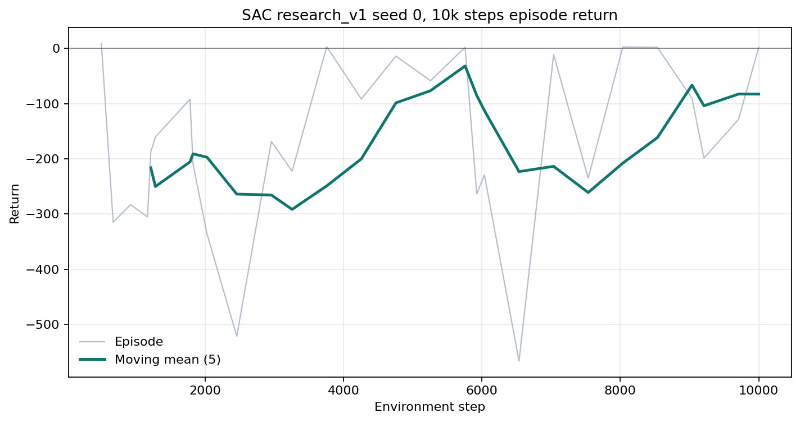
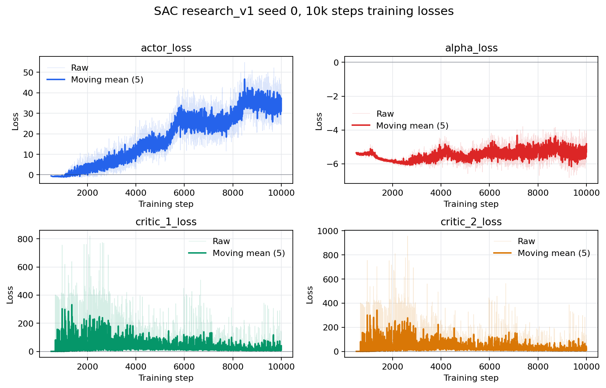

# Soft Actor-Critic (SAC)

**Family:** online, off-policy. **Paper:** [Soft Actor-Critic](https://arxiv.org/abs/1801.01290).
**Implementation:** [`carla_rl_lab/algorithms/sac.py`](../../carla_rl_lab/algorithms/sac.py).
**Runner:** [`scripts/train.py`](../../scripts/train.py).

## Principle

SAC learns a stochastic tanh-squashed Gaussian policy and two Q-functions. The
critic target uses the smaller target Q estimate and subtracts the entropy
term:

```text
y = r + gamma * (1 - terminal) * [min(Q1'(s', a'), Q2'(s', a'))
                                  - alpha * log pi(a'|s')]
```

Each critic minimizes mean squared Bellman error. The actor minimizes
`E[alpha * log pi(a|s) - min(Q1, Q2)]`. Temperature `alpha` is learned against
`target_entropy`; target critics use Polyak updates with coefficient `tau`.
This repository provides the plain MLP encoder and an optional semantic
attention encoder without changing the update equations.

## Start Training

```bash
python scripts/train.py \
  --algo sac \
  --total-timesteps 100000 \
  --checkpoint-interval 10000 \
  --action-mode longitudinal_2d \
  --reward research_v2 \
  --town Town05 --vehicles 50 --walkers 0 --traffic off --view-mode none \
  --max-time-episode 500 \
  --seed 0 \
  --logger tensorboard \
  --checkpoint-replay-buffer \
  --run-name v0.1/sac_town05_carla0915_seed0
```

Resume with a larger absolute step budget:

```bash
python scripts/train.py \
  --checkpoint artifacts/runs/v0.1/sac_town05_carla0915_seed0/checkpoints/sac_ckpt_last.pt \
  --total-timesteps 200000
```

## Metrics

Inspect `train/critic_1_loss`, `train/critic_2_loss`, `train/actor_loss`,
`train/alpha_loss`, `train/alpha`, `train/entropy`, and `train/avg_q` together
with episode return, safety cost, action distributions, and every reward term.
Finite losses alone do not prove that the car learned to drive.

## CarlaRLLab Result

The first pilot is deliberately retained as a negative result:

| Field | Value |
| --- | --- |
| Code | `ed5755a` |
| CARLA | client/server 0.9.15 |
| Training | Town05, 50 vehicles, seed 0, 10,000 steps |
| Reward / action | `research_v1` / `longitudinal_2d` |
| Runtime | 954.77 s |
| Evaluation | `lane_following_v0`, seeds 0-4 |
| Return | 0.607 mean, 8.243 std |
| Speed / distance | 0.021 m/s / 0.494 m mean |
| Stationary rate | 97.12% |
| Success rate | 0% |

All five evaluations reached the 500-step horizon, but the policy barely
moved. This is a stationary-policy failure, not a successful baseline. It
motivated `research_v2`, which preserves `research_v1` for reproducibility and
adds an explicit progress term plus a small smooth idle penalty.





Raw/downsampled values and provenance are in
[`docs/results/sac_research_v1_seed0_10k`](../results/sac_research_v1_seed0_10k/).
The next publishable result remains pending a `research_v2` pilot and three
successful training seeds.
