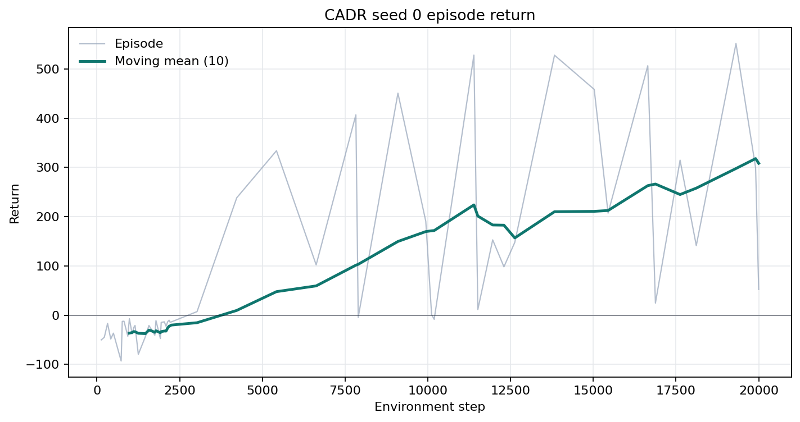
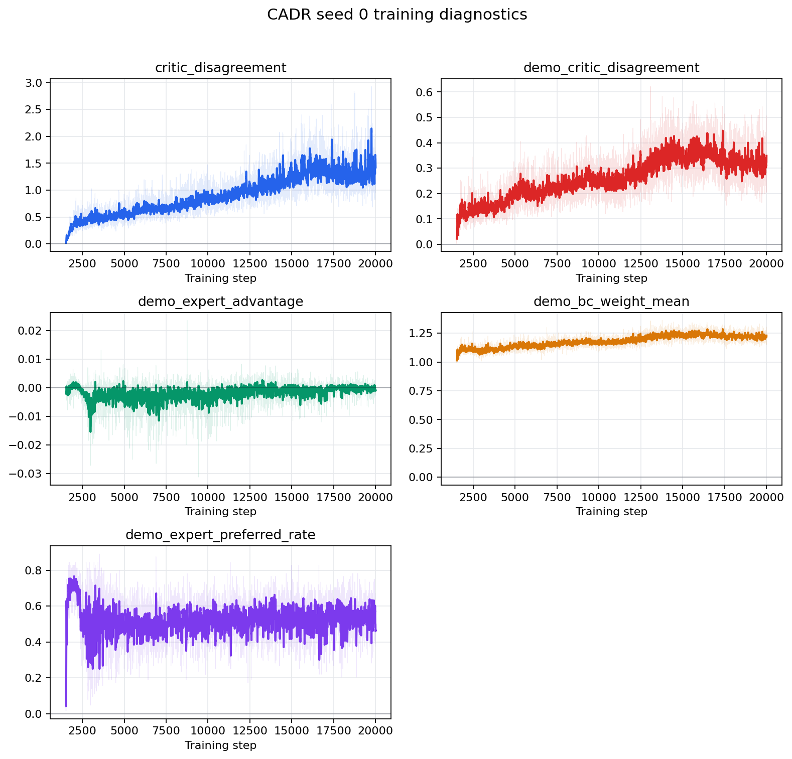

# CADR Ablation Evidence

This directory records the Confidence-Adaptive Demonstration Regularization
experiments described in [`docs/research/cadr.md`](../../../docs/research/cadr.md).
The corrected seed-0 run is a negative result: all evaluated checkpoints
reached 20% success on the fixed 10-episode selector, below fixed-BC SAC's 60%
at 8k steps.

The evidence bundle contains the complete run record, sampled TensorBoard
scalars, publication-ready curves, per-episode selector reports, and hashes for
every evaluated checkpoint. Checkpoint binaries are not tracked because this
configuration was rejected; its reports contain model metadata and SHA-256
identities.

## Files

- `EXPERIMENT_LOG.md`: chronological validity and result ledger.
- `seed0_2026-08-14/run_config.json`: exact command, environment, source, and
  dataset identity.
- `seed0_2026-08-14/export/`: scalar CSV, summary JSON, and curves.
- `seed0_2026-08-14/evaluations/`: raw 8k/12k/16k/20k reports and evaluator
  run records.
- `seed0_2026-08-14/evaluated_checkpoints.json`: explicit evaluated model
  hashes, including candidates removed by bounded checkpoint retention.

