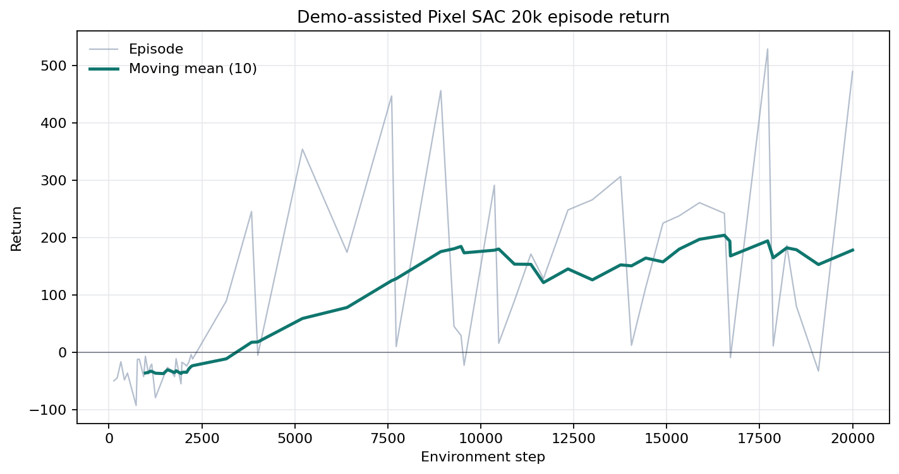
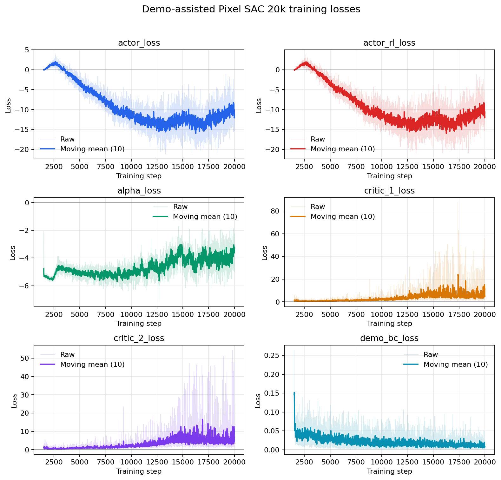
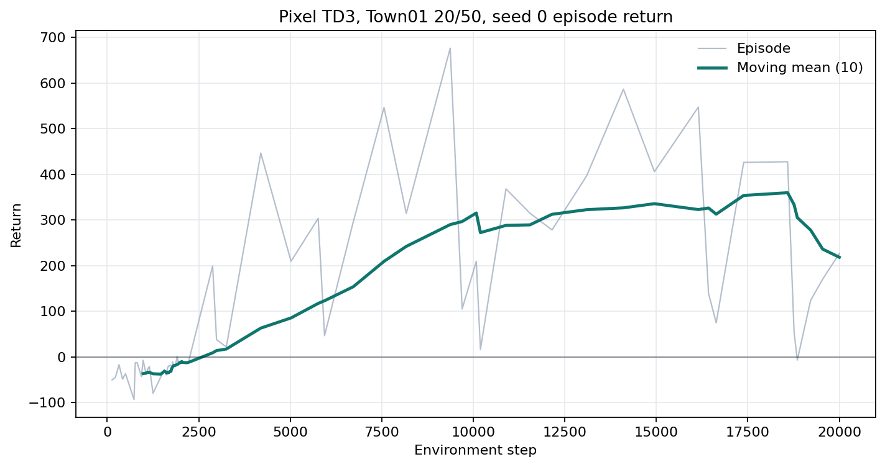
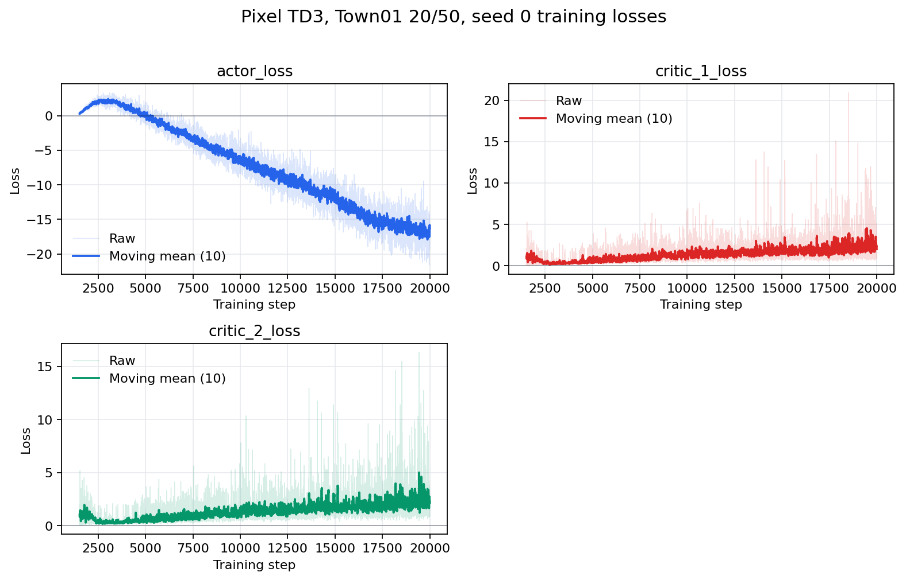

# RLfOLD NoCrash 0.9.15 Seed-0 Pilot

This directory is the tracked evidence bundle for the first CarlaRLLab
vision-based pilot. It is a **single-seed, small-budget pilot**, not a
three-seed baseline and not a claim of equivalence to the original RLfOLD or
RLAD scores.

## Contract

| Field | Value |
| --- | --- |
| CARLA | client `0.9.15`, server `0.9.15` |
| Hardware | NVIDIA GeForce RTX 4060 Laptop GPU, 8 GB |
| Policy input | one front RGB camera, `256x256` source resized to `84x84`, 2-frame stack, 10 route points, speed, previous steer |
| Policy state | `42,358` packed `uint8` values; no LiDAR, risk field, global pose, or nearby-actor state |
| Action | normalized target speed and steering |
| Training | Town01 `nocrash_train_regular_v0`, fixed 20 vehicles / 50 walkers, four training weathers |
| Selection grid | Town02 Empty, routes 0-4, both held-out weathers, 10 episodes |
| Seed | `0` |

The fixed 20/50 training curriculum is lighter than RLfOLD's full sampled
0-150/0-300 training distribution. This distinction is intentional and must
remain attached to these numbers.

## Candidate Selection

All rows use exactly the same 10-episode selection grid. Success requires route
completion with zero collisions.

| Method | Train budget | Selected step | Success | Route completion | Collision rate | Off-road rate |
| --- | ---: | ---: | ---: | ---: | ---: | ---: |
| Pixel SAC | 20k env steps | 8k | 0% | 0.360 | 40% | 70% |
| Pixel TD3 | 20k env steps | 8k | 40% | 0.999 | 40% | 20% |
| Pixel BC | 10k updates, 10k demonstrations | 10k | 20% | 0.530 | 40% | 80% |
| Pixel PPO | 20k env steps | 20k | 0% | 0.482 | 60% | 80% |
| Pixel SAC + demonstrations | 5k BC pretrain + 20k env steps | **8k** | **60%** | **0.786** | **20%** | **20%** |

The original Pixel SAC per-episode selection report was overwritten before
evaluation scopes were isolated in commit `1e0c665`; its scalar training data
and recovered aggregate are retained, but it is excluded from claims requiring
raw per-episode evidence. New evaluations use checkpoint- and scope-specific
paths and atomically save every completed episode.

## Selected Checkpoint

The selected policy is demonstration-assisted Pixel SAC at environment step
8,000:

```text
sha256: 9ff30f291781814d33f6ee56005eb78d878de9340065c78ca41a4f3124349c2a
source commit: 5ffa947808071ed87194a6480cec6c4c3dd66171
```

Download the tracked
[`sac_demo_seed0_step8000.pt`](checkpoints/sac_demo_seed0_step8000.pt)
checkpoint and verify it with `sha256sum` before evaluation.

It used 5,000 supervised actor updates followed by the joint objective:

```text
L_actor = L_SAC + 0.5 * MSE(pi(s_demo), a_demo)
```

The demonstration dataset contains 10,000 transitions collected in Town01
20/50 traffic with CARLA BehaviorAgent (`normal`):

```text
sha256: aa39eb1f06341574c6c7dc693cfb8265014db21fb1da4b7f5e9b604c71ace9de
shape:   states (10000, 42358) uint8; actions (10000, 2) float32
```

## Full Evaluation

The selected checkpoint was then frozen and evaluated on all 25 Town02 routes
under both held-out weathers. These are test results, not checkpoint-selection
scores.

| Traffic | Episodes | Success | Route completion | Collision rate | Off-road rate | Collisions / km |
| --- | ---: | ---: | ---: | ---: | ---: | ---: |
| Empty, 0/0 | 50 | **46%** | 0.753 | 18% | 34% | 0.759 |
| Regular, 15/50 | 50 | **24%** | 0.674 | 52% | 36% | 4.771 |
| Dense, 70/150 requested | 50 | **4%** | 0.469 | 82% | 24% | 15.432 |

The Empty result contains 23 successes. Regular contains 12 successes; vehicle
collisions are the dominant safety failure. Dense contains 2 successes and
shows severe vehicle-collision and blockage sensitivity. This evaluator version
stored requested traffic counts but not actual spawned counts; commit following
this run adds both fields to future reports, so the row is explicitly labeled
`requested`.

## Curves

### Demonstration-assisted Pixel SAC





### Pixel TD3





PPO, BC, and plain SAC curves are also stored under [`curves/`](curves/).
Raw, downsampled TensorBoard scalar exports are stored under
[`scalars/`](scalars/).

The curves are evidence from one run, not confidence intervals. Assisted SAC's
critic losses rise late in training while the 12k-20k selector scores fall;
this is why step 8k is frozen and why longer training is not reported as an
automatic improvement.

## Reproduce

Start CARLA with the reference command and export the matching navigation API:

```bash
cd "$CARLA_ROOT"
./CarlaUE4.sh -RenderOffScreen -quality_level=Low-prefernvidia

cd "$CARLA_RL_LAB_ROOT"
export PYTHONPATH="$CARLA_ROOT/PythonAPI/carla:$CARLA_ROOT/PythonAPI/carla/dist/carla-0.9.15-py3.7-linux-x86_64.egg:${PYTHONPATH:-}"
```

Collect demonstrations:

```bash
python scripts/collect_dataset.py \
  --policy autopilot --transitions 10000 \
  --output artifacts/datasets/rlfold_town01_regular_behavior_agent_seed0_10k.npz \
  --benchmark nocrash_train_regular_v0 \
  --action-mode target_speed_2d --reward nocrash_v0 \
  --view-mode none --seed 0 --port 2000
```

Train the selected method:

```bash
python scripts/train.py \
  --algo sac --benchmark nocrash_train_regular_v0 \
  --total-timesteps 20000 --checkpoint-interval 2000 \
  --minimal-size 1500 --batch-size 64 --buffer-size 15000 \
  --hidden-dim 128 \
  --expert-dataset artifacts/datasets/rlfold_town01_regular_behavior_agent_seed0_10k.npz \
  --demo-pretrain-updates 5000 --demo-bc-coef 0.5 \
  --view-mode none --logger tensorboard \
  --run-name pilots/rlfold_town01_regular_pixel_sac_demo_seed0_20k_20260813 \
  --seed 0 --port 2000 --require-clean-git
```

Evaluate with interruption-safe progress:

```bash
python scripts/evaluate.py \
  --algo sac --checkpoint /path/to/sac_ckpt_8000.pt \
  --suite rlfold_nocrash_0915_v0 \
  --output-tag selected --logger tensorboard --port 2000

# Use the same command with --resume after an interrupted process.
```

## Artifact Map

- `curves/`: publication-ready reward and loss PNG files.
- `scalars/`: sampled raw TensorBoard scalar CSV files.
- `runs/`: full run configuration and scalar summaries.
- `evaluations/`: per-episode full benchmark JSON reports.
- `manifests/`: immutable checkpoint names and SHA-256 values.
- `checkpoints/`: the selected 7.3 MB seed-0 pilot checkpoint.

The 245 MB demonstration dataset and future multi-checkpoint sets remain
outside Git history. Their hashes and collection commands are the identity
contract.
